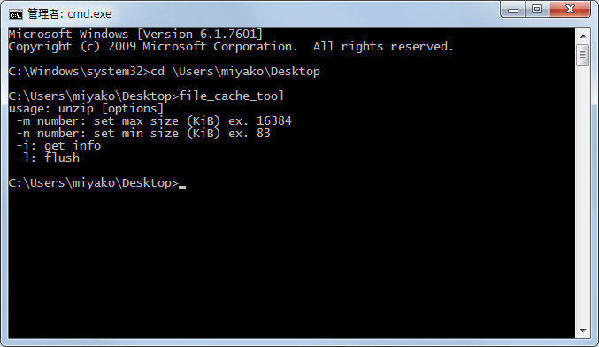

# console-file-cache-tool
A Windows console program to read and write the system file cache size limits.

About
-----
There is a [known issue on Windows earlier than Server 2008 R2 SP1](http://support.microsoft.com/kb/976618), where the system file cache could consume so much physical memory that other running applications could experience severe cosequences.

The problem is especially serious on 32 bit systems, since adding more memory to the system will not improve the situation; all available memory addresses will be taken by the system file cache.

**For example, you may not be able to complete a conversion of a large 4D database.**

One way to solve this issue is to use [SetSystemFileCacheSize](http://msdn.microsoft.com/en-us/library/aa965240(VS.85).aspx) and impose a limit on the amount of memory the system file cache can consume.

This console program is designed to let you do just that from the command-line.

**Note**
The problem should be solved as of Windows Server 2008 R2 SP1. In addition, there is a [fix] (http://support.microsoft.com/kb/979149) for Windows 7 and Windows 2008 R2.

This program is mainly intended for users running a large database application on systems before Windows Server 2008 R2, and having the kind of problems described above.

**Related article**
http://serverfault.com/questions/325277/windows-server-2008-r2-metafile-ram-usage/527466#527466

Example
-------
Create a shortcut to the Command Prompt（windows/system32/cmd.exe）on the Desktop or some other location.

Right-click the shortcut and "Run as Administrator".

Run file_cache_tool from the command line.

**Options**
* -m Set the maximum size (may return error 87 if the size is too small)
* -n Set the minimum size (0 will result in the default value)
* -i Check current values
* -l Flush the system file cache

